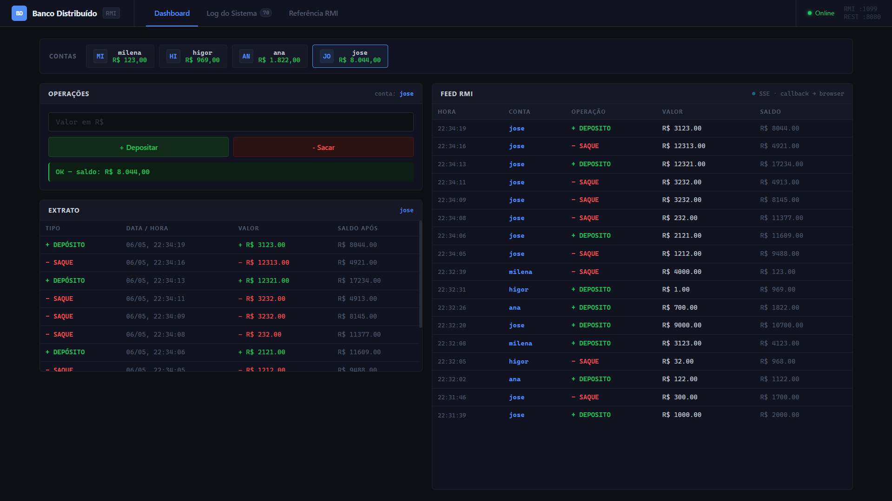
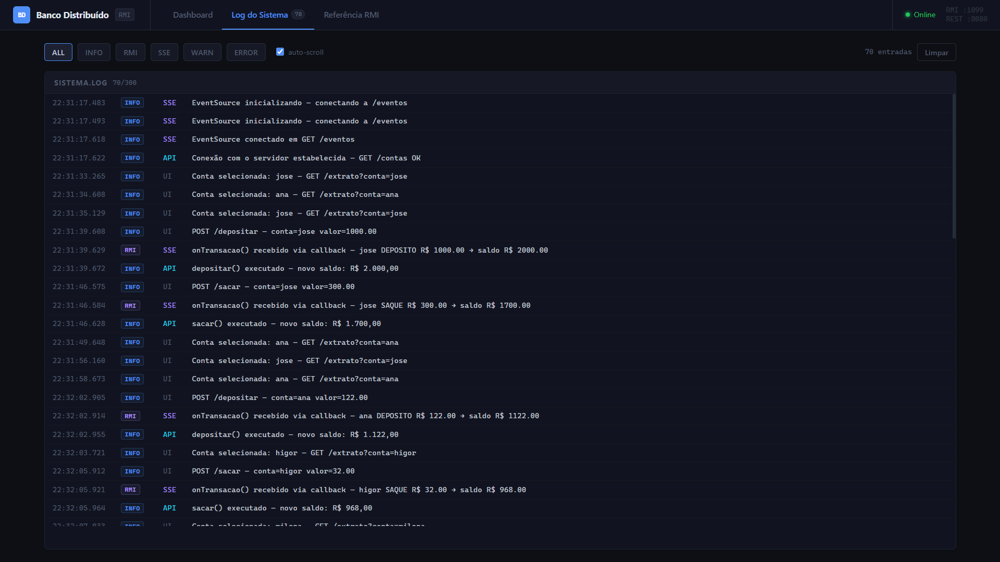
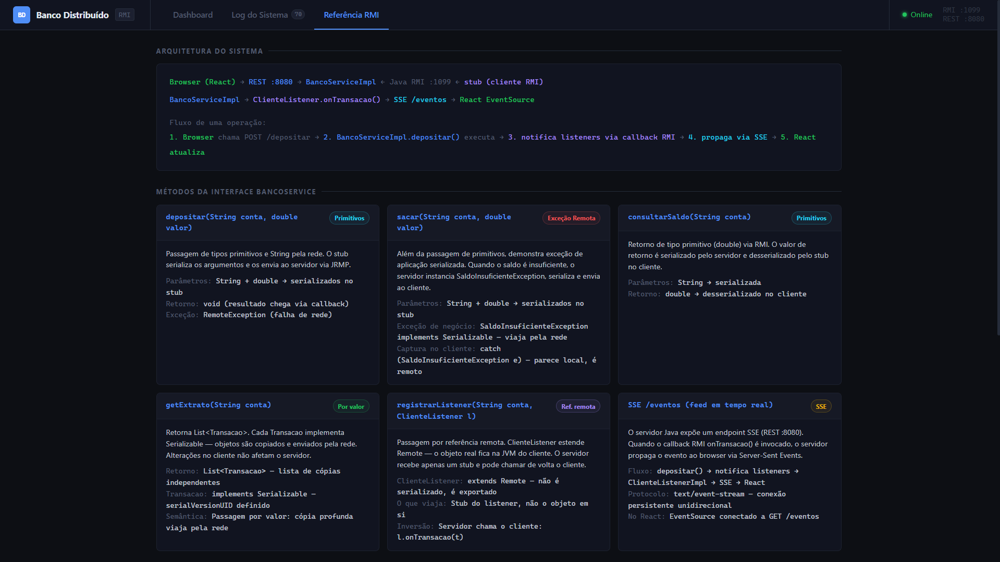

# Banco Distribuído — Java RMI

Estudo de caso de **Java RMI** para a disciplina de Sistemas Distribuídos.  
Implementa um banco distribuído com interface React em tempo real.

**Grupo:** Ana Iara Loayza Costa · José Victor Brito Costa · Higor Pinheiro Costa · Milena Freire Britto Neves

---

## O que este projeto demonstra

| Conceito RMI | Onde aparece no código |
|---|---|
| Interface remota (`extends Remote`) | `comum/BancoService.java` |
| Objeto remoto (`UnicastRemoteObject`) | `servidor/BancoServiceImpl.java` |
| Passagem por valor (serialização) | `comum/Transacao.java` → `getExtrato()` |
| Passagem por referência remota | `comum/ClienteListener.java` → `registrarListener()` |
| RMI Registry | `servidor/Servidor.java` → `createRegistry` / `rebind` |
| `RemoteException` | Todos os métodos da interface remota |
| Exceção serializada pela rede | `comum/SaldoInsuficienteException.java` |
| Callback servidor → cliente | `notificarListeners()` → SSE → browser |

---

## Arquitetura

```
┌─────────────────────┐          ┌──────────────────────────┐
│   React (Vite)      │◄─ SSE ──►│   Servidor Java          │
│   localhost:5173    │◄─ REST ──►│   REST  :8080            │
└─────────────────────┘          │   RMI   :1099            │
                                 └──────────────────────────┘
         ▲                                    ▲
         │  operações via browser             │  cliente terminal (opcional)
                                       java -cp out cliente.Cliente
```

---

## Screenshots

### Dashboard


### Logs em tempo real


### Referências RMI


---

## Pré-requisitos

- Java 11+ (`java --version`)
- Node.js 18+ (`node --version`)

---

## Como rodar

### Opção 1 — Script automático (recomendado)

```bash
chmod +x run.sh
./run.sh
```

Abre o browser em **http://localhost:5173**.  
`Ctrl+C` encerra tudo.

### Opção 2 — Manual (dois terminais)

**Terminal 1 — Backend:**
```bash
mkdir -p out
javac -d out -sourcepath src src/comum/*.java src/servidor/*.java src/cliente/*.java
java -cp out servidor.Servidor
```

**Terminal 2 — Frontend:**
```bash
cd frontend
npm install
npm run dev
```

### Opção 3 — Apenas terminal (sem frontend)

```bash
# Terminal 1
java -cp out servidor.Servidor

# Terminal 2
java -cp out cliente.Cliente
```

---

## Estrutura do projeto

```
rmi-banco-distribuido/
├── src/
│   ├── comum/
│   │   ├── BancoService.java            # Interface remota principal
│   │   ├── ClienteListener.java         # Interface de callback (referência remota)
│   │   ├── Transacao.java               # Objeto serializado (passagem por valor)
│   │   └── SaldoInsuficienteException.java
│   ├── servidor/
│   │   ├── BancoServiceImpl.java        # Implementação do objeto remoto
│   │   ├── ApiRest.java                 # HTTP server (REST + SSE)
│   │   └── Servidor.java               # Ponto de entrada
│   └── cliente/
│       ├── ClienteListenerImpl.java     # Callback exportado como objeto remoto
│       └── Cliente.java                # Cliente de terminal
├── frontend/                           # Interface React
│   └── src/
│       ├── api.js                      # Funções de acesso à API REST
│       ├── App.jsx                     # Componente raiz
│       └── components/
│           ├── Header.jsx
│           ├── ContaCard.jsx
│           ├── Operacoes.jsx
│           ├── Extrato.jsx
│           └── EventosFeed.jsx
├── article/                            # Apresentação LaTeX
├── run.sh                              # Lançador único
└── README.md
```

---

## Endpoints da API REST

| Método | Endpoint | Descrição |
|---|---|---|
| GET | `/contas` | Lista todas as contas com saldo |
| POST | `/depositar` | `{"conta":"joao","valor":100}` |
| POST | `/sacar` | `{"conta":"joao","valor":100}` |
| GET | `/extrato?conta=joao` | Histórico de transações |
| GET | `/eventos` | SSE — stream de notificações em tempo real |

---

## Referências

- TANENBAUM, A. S.; VAN STEEN, M. *Sistemas Distribuídos: Princípios e Paradigmas*. 2. ed. Pearson, 2007.
- COULOURIS, G. et al. *Sistemas Distribuídos: Conceitos e Projeto*. 5. ed. Bookman, 2013.
- Oracle. *Java RMI Specification*. https://docs.oracle.com/en/java/javase/25/docs/specs/rmi/index.html
- Oracle. *Removed Tools — rmic*. https://docs.oracle.com/en/java/javase/26/migrate/removed-tools-components.html
- OpenJDK. *JEP 486: Permanently Disable the Security Manager*. https://openjdk.org/jeps/486
